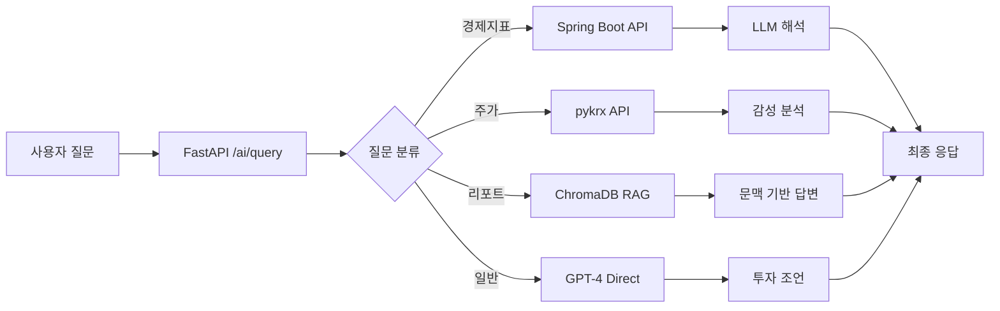

# 🤖 AI 투자 어드바이저 (jeonbongjun-ai)

<div align="center">


**LangChain + RAG 기반 실시간 투자 상담 AI 서비스**

[특징](#-주요-특징) • [아키텍처](#-시스템-아키텍처) • [시작하기](#-빠른-시작) • [API 문서](#-api-문서) • [배포](#-배포)

</div>

---

## 📋 목차

- [개요](#-개요)
- [주요 특징](#-주요-특징)
- [시스템 아키텍처](#-시스템-아키텍처)
- [기술 스택](#-기술-스택)
- [프로젝트 구조](#-프로젝트-구조)
- [빠른 시작](#-빠른-시작)
- [API 문서](#-api-문서)
- [질문 처리 파이프라인](#-질문-처리-파이프라인)
- [배포](#-배포)
- [개발 가이드](#-개발-가이드)
- [트러블슈팅](#-트러블슈팅)
- [라이선스](#-라이선스)

---

## 🎯 개요

AI 투자 어드바이저는 **LangChain**과 **RAG(Retrieval-Augmented Generation)** 기술을 활용하여 실시간 투자 상담을 제공하는 지능형 AI 서비스입니다.

### 핵심 기능
- 📊 **실시간 주가 분석** - pykrx API를 통한 한국 주식시장 데이터
- 📈 **경제지표 해석** - MariaDB 기반 거시경제 지표 분석
- 📑 **증권사 리포트 검색** - ChromaDB 벡터 검색을 통한 애널리스트 리포트 분석
- 💡 **개인화된 투자 조언** - GPT-4 기반 맞춤형 투자 전략 제공

---

## ✨ 주요 특징

### 🔍 지능형 질문 분류 시스템
```
사용자 질문 → AI 분류기 → 4가지 카테고리
├─ economic_indicator (경제지표)
├─ stock_price (주가 분석)
├─ analyst_report (증권사 리포트)
└─ general (일반 투자 상담)
```

### 🎨 하이브리드 데이터 소스
| 카테고리 | 데이터 소스 | 처리 방식 |
|---------|-----------|---------|
| 경제지표 | MariaDB (Spring Boot) | REST API + LLM 해석 |
| 주가 데이터 | pykrx (한국거래소) | Real-time API + 감성 분석 |
| 리포트 | ChromaDB (PDF 임베딩) | RAG 검색 + LLM 답변 |
| 일반 상담 | - | GPT-4 Direct |

### ⚡ 고성능 아키텍처
- **비동기 처리**: FastAPI + httpx를 통한 고속 API 처리
- **벡터 검색**: ChromaDB를 활용한 의미 기반 문서 검색
- **캐싱**: 대시보드 데이터 60초 캐싱으로 성능 최적화
- **컨테이너화**: Docker + Kubernetes 기반 마이크로서비스

---

## 🏗 시스템 아키텍처

```
┌─────────────────────────────────────────────────────────────┐
│                      Frontend (React)                        │
└──────────────────────────┬──────────────────────────────────┘
                           │ HTTP
┌──────────────────────────▼──────────────────────────────────┐
│              Backend (Spring Boot - Port 8080)               │
│  ┌──────────────────────────────────────────────────────┐   │
│  │ Controllers: /api/chat, /api/stocks, /api/indicators│   │
│  └────────────────────┬─────────────────────────────────┘   │
│                       │                                      │
│  ┌────────────────────▼─────────────────────────────────┐   │
│  │          MariaDB (경제지표, 종목 마스터)              │   │
│  └──────────────────────────────────────────────────────┘   │
└──────────────────────────┬──────────────────────────────────┘
                           │ HTTP
┌──────────────────────────▼──────────────────────────────────┐
│               AI Service (FastAPI - Port 8000)               │
│                                                               │
│  ┌─────────────────────────────────────────────────────┐    │
│  │  POST /ai/query (메인 질문 처리 엔드포인트)          │    │
│  └────────────────────┬────────────────────────────────┘    │
│                       │                                      │
│  ┌────────────────────▼────────────────────────────────┐    │
│  │         Question Classifier (LLM 기반 분류)         │    │
│  └──┬──────────┬──────────┬──────────┬─────────────────┘    │
│     │          │          │          │                       │
│  ┌──▼───┐  ┌──▼───┐  ┌───▼──┐  ┌────▼────┐                 │
│  │Economic│Stock  │Analyst│General │                        │
│  │Chain  │Chain  │Chain  │Chain  │                         │
│  └──┬───┘  └──┬───┘  └───┬──┘  └────┬────┘                 │
│     │         │          │          │                       │
│  ┌──▼─────┐ ┌▼──────┐ ┌─▼─────┐   │                        │
│  │MariaDB │ │pykrx  │ │ChromaDB   │                       │
│  │via API │ │API    │ │Vector DB│  │                        │
│  └────────┘ └───────┘ └────────┘   │                        │
│                                     │                        │
│  ┌──────────────────────────────────▼────────────────────┐  │
│  │          GPT-4 Turbo (OpenAI API)                      │  │
│  └─────────────────────────────────────────────────────────┘ │
└───────────────────────────────────────────────────────────────┘
```

### 데이터 플로우



---

## 🛠 기술 스택

### Core Framework
- **FastAPI** 0.110.0 - 고성능 비동기 웹 프레임워크
- **Python** 3.10+ - 안정적인 최신 버전

### AI/ML Stack
- **LangChain** 0.3.27 - LLM 애플리케이션 프레임워크
- **OpenAI GPT-4 Turbo** - 자연어 이해 및 생성
- **ChromaDB** 0.4.24 - 벡터 데이터베이스
- **tiktoken** 0.12.0 - 토큰 카운팅

### Data Sources
- **pykrx** 1.0.51 - 한국거래소 API
- **httpx** 0.28.1 - 비동기 HTTP 클라이언트
- **pandas** 2.2.1 - 데이터 분석

### Document Processing
- **pypdf** 4.1.0 - PDF 문서 파싱
- **langchain-text-splitters** - 스마트 텍스트 청킹

### DevOps
- **Docker** - 컨테이너화
- **Kubernetes** (GKE) - 오케스트레이션
- **GitHub Actions** - CI/CD

---

## 📁 프로젝트 구조

```
jeonbongjun-ai/
├── 📂 chains/                      # LangChain 체인 로직
│   ├── __init__.py
│   ├── classifier.py               # 질문 분류기 (4-way classification)
│   ├── rag_chain.py                # RAG 체인 (증권사 리포트)
│   ├── indicator_chain.py          # 경제지표 분석 체인
│   ├── stock_chain.py              # 주가 분석 + 감성 분석
│   └── general_chain.py            # 일반 투자 상담
│
├── 📂 routers/                     # FastAPI 라우터
│   └── market_data.py              # 시장 데이터 API
│       ├── GET /api/dashboard      # 통합 대시보드
│       ├── GET /api/stock/{ticker} # 개별 종목 조회
│       └── POST /api/stock-details # 다중 종목 조회
│
├── 📂 utils/                       # 유틸리티 모듈
│   ├── config.py                   # 환경 설정 (Pydantic)
│   ├── logger.py                   # 로깅 설정
│   ├── embedder.py                 # OpenAI 임베딩
│   ├── db_client.py                # ChromaDB 클라이언트
│   ├── spring_client.py            # Spring Boot API 클라이언트
│   ├── data_loader.py              # 문서 로더 (PDF/CSV/JSON)
│   └── text_splitter.py            # 텍스트 청킹
│
├── 📂 notebooks/                   # Jupyter 실험 노트북
│   ├── 01_classifier_test.ipynb    # 분류기 테스트
│   ├── 02_rag_test.ipynb           # RAG 파이프라인 테스트
│   └── test_full_pipeline.ipynb    # 전체 통합 테스트
│
├── 📂 k8s/                         # Kubernetes 매니페스트
│   ├── ai-service-deployment.yaml  # Deployment 설정
│   ├── ai-service-service.yaml     # Service (ClusterIP)
│   └── ai-config.yaml              # BackendConfig (Health Check)
│
├── 📂 .github/workflows/           # GitHub Actions CI/CD
│   └── build-push-ai.yaml          # Docker 이미지 빌드 및 푸시
│
├── 📂 data/                        # 데이터 디렉토리 (gitignore)
│   ├── reports/                    # 증권사 리포트 PDF
│   ├── news/                       # 뉴스 데이터
│   └── indicators/                 # 경제지표 CSV
│
├── 📂 embeddings/                  # ChromaDB 저장소 (gitignore)
│   └── chromadb/                   # 벡터 임베딩 DB
│
├── 📂 logs/                        # 로그 파일 (gitignore)
│
├── 📄 main.py                      # FastAPI 애플리케이션 엔트리포인트
├── 📄 Dockerfile                   # Docker 이미지 빌드 설정
├── 📄 requirements.txt             # Python 의존성
├── 📄 .env.example                 # 환경 변수 템플릿
├── 📄 .gitignore                   # Git 제외 파일
└── 📄 README.md                    # 프로젝트 문서 (본 파일)
```

---

## 🚀 빠른 시작

### 1️⃣ 사전 요구사항

- Python 3.10 이상
- Docker (선택사항)
- OpenAI API 키
- Spring Boot 백엔드 서버 (포트 8080)

### 2️⃣ 설치

```bash
# 저장소 클론
git clone https://github.com/yourusername/jeonbongjun-ai.git
cd jeonbongjun-ai

# 가상환경 생성 및 활성화
python -m venv venv
source venv/bin/activate  # Windows: venv\Scripts\activate

# 의존성 설치
pip install -r requirements.txt
```

### 3️⃣ 환경 설정

```bash
# .env 파일 생성
cp .env.example .env

# .env 파일 편집 (필수!)
# OPENAI_API_KEY=sk-proj-your-actual-api-key
```

**.env 예시**
```ini
# OpenAI API
OPENAI_API_KEY=sk-proj-your-actual-api-key-here

# FastAPI Settings
HOST=0.0.0.0
PORT=8000
DEBUG=True

# ChromaDB
CHROMA_DB_PATH=./embeddings/chromadb

# Logging
LOG_LEVEL=INFO
LOG_FILE=./logs/app.log
```

### 4️⃣ 서버 실행

```bash
# FastAPI 서버 시작
python main.py

# 또는 uvicorn 직접 실행
uvicorn main:app --host 0.0.0.0 --port 8000 --reload
```

서버 실행 후 접속:
- **API 문서**: http://localhost:8000/docs
- **헬스 체크**: http://localhost:8000/health

---

## 📡 API 문서

### Core Endpoints

#### 1. 헬스 체크
```http
GET /health
```

**응답 예시**
```json
{
  "status": "ok",
  "service": "InvestAI Core",
  "version": "1.0.0",
  "timestamp": "2026-01-18T10:30:00.000Z"
}
```

#### 2. AI 질문 처리 (메인 엔드포인트)
```http
POST /ai/query
Content-Type: application/json
```

**요청 바디**
```json
{
  "session_id": "user123-session456",
  "question": "삼성전자의 AI 반도체 전망은 어때?"
}
```

**응답 예시**
```json
{
  "session_id": "user123-session456",
  "question": "삼성전자의 AI 반도체 전망은 어때?",
  "answer": "NH투자증권 리포트에 따르면, 삼성전자는 HBM3E 양산 시작으로...",
  "category": "analyst_report",
  "sources": [
    {
      "title": "NH투자증권_삼성전자_20251015.pdf",
      "securities_firm": "NH투자증권",
      "date": "20251015",
      "content": "AI 반도체 시장에서 삼성전자는..."
    }
  ],
  "timestamp": "2026-01-18T10:35:00.000Z"
}
```

#### 3. 대시보드 데이터 조회
```http
GET /api/dashboard
```

**응답 구조**
```json
{
  "indices": {
    "kospi": {
      "value": 2850.34,
      "changeValue": 12.5,
      "changeRate": 0.44,
      "chartData": [{"value": 2840}, {"value": 2850}, ...]
    },
    "kosdaq": { ... }
  },
  "topGainers": [
    {"code": "005930", "name": "삼성전자", "price": 75000, "change_rate": 3.5}
  ],
  "topLosers": [...],
  "topVolume": [...],
  "topMarketCap": [...]
}
```

#### 4. 개별 종목 조회
```http
GET /api/stock/{ticker}
```

**예시**
```bash
curl http://localhost:8000/api/stock/005930
```

**응답**
```json
{
  "name": "삼성전자",
  "ticker": "005930",
  "price": 75000,
  "changePct": 2.3,
  "ohlc": {
    "open": 74000,
    "high": 76000,
    "low": 73500
  }
}
```

---

## 🔄 질문 처리 파이프라인

### 전체 흐름도

```
┌─────────────────────────────────────────────────────────────┐
│  1. 사용자 질문 입력                                          │
│     "삼성전자 AI 반도체 전망은?"                              │
└──────────────────────┬──────────────────────────────────────┘
                       │
┌──────────────────────▼──────────────────────────────────────┐
│  2. Question Classifier (GPT-4 기반)                         │
│     ┌───────────────────────────────────────────────────┐   │
│     │ Prompt: "다음 질문을 4가지 카테고리로 분류..."       │   │
│     │ Output: {"category": "analyst_report",           │   │
│     │          "stock_code": "005930"}                 │   │
│     └───────────────────────────────────────────────────┘   │
└──────────────────────┬──────────────────────────────────────┘
                       │
         ┌─────────────┴─────────────┐
         │                           │
┌────────▼────────┐         ┌────────▼────────┐
│ 3a. RAG Chain   │         │ 3b. Other Chains│
│ (analyst_report)│         │ (stock/economic)│
│                 │         │                 │
│ ChromaDB Search │         │ API Calls       │
│     ↓           │         │     ↓           │
│ Top 3 Documents │         │ Data Fetch      │
│     ↓           │         │     ↓           │
│ GPT-4 Generation│         │ GPT-4 Analysis  │
└────────┬────────┘         └────────┬────────┘
         │                           │
         └─────────────┬─────────────┘
                       │
┌──────────────────────▼──────────────────────────────────────┐
│  4. 최종 응답 생성                                            │
│     - 답변 (answer)                                          │
│     - 출처 (sources)                                         │
│     - 카테고리 (category)                                     │
│     - 타임스탬프                                              │
└─────────────────────────────────────────────────────────────┘
```

### 카테고리별 처리 상세

#### 📊 Economic Indicator Chain
```python
# 1. Spring Boot API에서 최신 경제지표 조회
indicators = await spring_client.get_economic_indicators()
# {"기준금리": "3.5%", "M2": "3500조원", ...}

# 2. GPT-4로 지표 해석 및 영향 분석
answer = llm.invoke(prompt_template.format(
    question=question,
    indicators=indicators_str
))
```

#### 📈 Stock Price Chain
```python
# 1. pykrx로 실시간 주가 조회
stock_data = get_stock_data_from_pykrx(stock_code)

# 2. 감성 분석 (등락률 기반)
sentiment = analyze_sentiment(stock_data)  # "긍정", "중립", "부정"

# 3. GPT-4로 주가 분석 및 시장 해석
answer = llm.invoke(prompt_template.format(
    stock_data=stock_str,
    sentiment=sentiment
))
```

#### 📑 Analyst Report Chain (RAG)
```python
# 1. ChromaDB 벡터 검색 (유사도 기반)
retriever = vectorstore.as_retriever(search_kwargs={"k": 3})
docs = retriever.get_relevant_documents(question)

# 2. 검색된 문서를 컨텍스트로 GPT-4 호출
qa_chain = RetrievalQA.from_chain_type(
    llm=llm,
    retriever=retriever,
    return_source_documents=True
)
result = qa_chain({"query": question})
```

#### 💡 General Advice Chain
```python
# GPT-4에 직접 질문 (외부 데이터 없음)
answer = llm.invoke(prompt_template.format(question=question))
```

---

## 🐳 배포

### Docker 배포

#### 1. 이미지 빌드
```bash
docker build -t ai-service:latest .
```

#### 2. 컨테이너 실행
```bash
docker run -d \
  --name ai-service \
  -p 8000:8000 \
  -e OPENAI_API_KEY=your-api-key \
  ai-service:latest
```

### Kubernetes 배포 (GKE)

#### 1. Secret 생성
```bash
kubectl create secret generic jeonbongjun-secrets \
  --from-literal=OPENAI_API_KEY=your-api-key \
  -n jeonbongjun
```

#### 2. 배포
```bash
# Deployment
kubectl apply -f k8s/ai-service-deployment.yaml

# Service
kubectl apply -f k8s/ai-service-service.yaml

# BackendConfig (Health Check)
kubectl apply -f k8s/ai-config.yaml
```

#### 3. 상태 확인
```bash
# Pod 상태
kubectl get pods -n jeonbongjun -l app=ai-service

# 로그 확인
kubectl logs -f deployment/ai-service-deployment -n jeonbongjun

# Health Check
kubectl exec -it <pod-name> -n jeonbongjun -- curl localhost:8000/health
```

### CI/CD (GitHub Actions)

프로젝트는 자동 빌드/배포 파이프라인을 포함합니다:

```yaml
# .github/workflows/build-push-ai.yaml
on:
  push:
    branches: [main]

jobs:
  - Docker 이미지 빌드
  - Docker Hub에 푸시
  - 멀티 아키텍처 지원 (amd64, arm64)
```

**Docker Hub**: `o11117/ai-service:latest`

---

## 👨‍💻 개발 가이드

### 증권사 리포트 임베딩

PDF 리포트를 ChromaDB에 임베딩하려면:

```bash
# 1. PDF 파일을 data/reports/에 추가
# 파일명 형식: {증권사명}_{종목명}_{날짜}.pdf
# 예: NH투자증권_삼성전자_20251015.pdf

# 2. 임베딩 스크립트 실행
python scripts/embed_reports.py
```

스크립트는 자동으로:
1. PDF 파일 로드
2. 페이지별로 텍스트 추출
3. 청킹 (500자, 50자 오버랩)
4. OpenAI 임베딩 생성
5. ChromaDB에 저장

### Jupyter Notebook 테스트

```bash
# Jupyter 실행
jupyter notebook

# 노트북 실행 순서:
# 1. notebooks/01_classifier_test.ipynb  (질문 분류 테스트)
# 2. notebooks/02_rag_test.ipynb         (RAG 파이프라인)
# 3. notebooks/test_full_pipeline.ipynb  (전체 통합)
```

### 로그 확인

```bash
# 실시간 로그 모니터링
tail -f logs/app.log

# 로그 레벨 변경 (.env)
LOG_LEVEL=DEBUG  # DEBUG, INFO, WARNING, ERROR
```

---

## 🔧 트러블슈팅

### 자주 발생하는 문제

#### 1. OpenAI API 오류
```
Error: Incorrect API key provided
```
**해결책**: `.env` 파일의 `OPENAI_API_KEY`를 확인하세요.

#### 2. ChromaDB 경로 오류
```
Error: Cannot access chromadb path
```
**해결책**: 
```bash
mkdir -p embeddings/chromadb
chmod 755 embeddings/chromadb
```

#### 3. pykrx 데이터 조회 실패
```
Error: 주가 데이터를 조회할 수 없습니다
```
**해결책**: 
- 주말/공휴일에는 데이터가 없을 수 있습니다.
- 종목 코드가 올바른지 확인하세요 (6자리 숫자).

#### 4. Kubernetes Pod Crash
```
CrashLoopBackOff
```
**체크리스트**:
```bash
# 1. Secret 확인
kubectl get secret jeonbongjun-secrets -n jeonbongjun

# 2. 로그 확인
kubectl logs <pod-name> -n jeonbongjun

# 3. Health Check 확인
kubectl describe pod <pod-name> -n jeonbongjun
```

#### 5. Spring Boot 연결 실패
```
Error: 경제지표 조회 HTTP 오류
```
**해결책**:
- `utils/spring_client.py`에서 `base_url` 확인
- Kubernetes: `http://backend-svc:8080`
- 로컬: `http://localhost:8080`

---

## 📝 향후 개발 계획

- [ ] **멀티턴 대화 지원** - 세션 기반 대화 컨텍스트 유지
- [ ] **실시간 뉴스 크롤링** - 증권 뉴스 자동 수집 및 임베딩
- [ ] **백테스팅 시뮬레이션** - AI 추천 기반 가상 투자 성과 분석
- [ ] **감성 분석 고도화** - BERT 기반 뉴스/SNS 감성 분석
- [ ] **포트폴리오 최적화** - 현대 포트폴리오 이론(MPT) 적용
- [ ] **WebSocket 지원** - 실시간 스트리밍 응답
- [ ] **다국어 지원** - 영어/중국어 질문 처리

---

## 📜 라이선스

이 프로젝트는 MIT 라이선스 하에 배포됩니다. 자세한 내용은 [LICENSE](LICENSE) 파일을 참조하세요.

